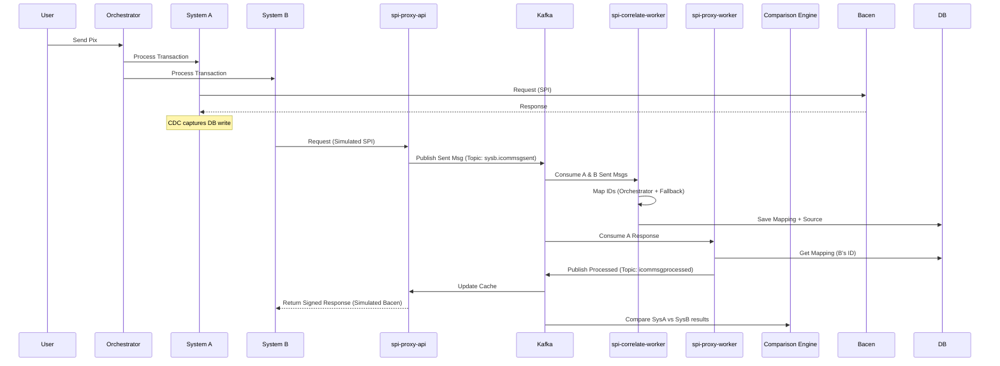

# Coexistence Solution Specification: Pix System Migration

## 1. Problem
A proprietary Pix system (**System A**) is currently in use at a Brazilian bank, handling messaging with the Central Bank of Brazil (Bacen). This system is being replaced by an internally developed system (**System B**). Since both cannot connect to the Bacen Pix APIs simultaneously without conflict, a solution is required to allow System B to process requests in parallel for validation (homologation) while System A remains the sole connection point.

## 2. Solution: The Coexistence Layer
The solution maintains System A as the primary interface with Bacen while redirecting System B's traffic to a proxy layer that simulates Bacen's behavior. 

### 2.1 Identification & Correlation
System A and System B generate independent identifiers (e.g., `EndToEndId`). The **spi-correlate-worker** must map these IDs to ensure responses from Bacen are correctly routed to System B.

* **Primary Strategy:** Query the orchestrator data to find the link between System A and System B transaction IDs.
* **Fallback Strategy:** Match by **Timestamp** (within a defined window), **Amount**, and **Payer/Payee details**.
* **Monitoring:** The source of correlation (Orchestrator vs. Heuristic) must be stored in the database and logged to evaluate the accuracy of the fallback strategy.

### 2.2 Idempotency & Error Handling
* **Idempotency:** Handled via the `MessageId` present in every SPI API message. The proxy and workers must use this ID to prevent duplicate processing.
* **Error Simulation:** If System A receives an error response from Bacen, the Coexistence layer must simulate the same error (including error codes and signed XML) for System B.

---

## 3. Architecture

### 3.1 Sequence Diagram

### 3.2 APIs and Workers
* **Stack:** .NET 8, Clean Architecture, and DDD.
* **spi-proxy-api:** * **Caching:** Must implement a distributed cache (e.g., Redis) to store processed responses for quick retrieval by System B.
    * **Timeouts:** Configurable request timeout (default 30s). If the correlation/processing exceeds this, return a specific Bacen-compliant timeout error.
* **Messaging:** * Include **Dead Letter Queues (DLQ)** for every worker to handle processing failures without blocking topics.

### 3.3 Comparison Engine
A dedicated component to validate System B's accuracy against System A.
* **Function:** Consume "Sent" and "Processed" events from both systems.
* **Logic:** Compare business fields (Amount, Beneficiary, Message Type) while ignoring specific identifiers.
* **Output:** Log discrepancies to a dedicated dashboard/table for architectural review.

---

## 4. Database & Infrastructure

### 4.1 SQL Server (`DB_COEXISTENCE`)
The database must store the mapping between systems.

**Table: SpiSentMsg**
* `IdSystemA` (PK, VARCHAR, **Indexed**)
* `IdSystemB` (PK, VARCHAR, **Indexed**)
* `CorrelationSource` (VARCHAR: 'Orchestrator' or 'Heuristic')
* `CreatedAt` (DateTime2)

### 4.2 TTL and Cleanup
* **TTL (Time-To-Live):** Correlation mappings in `SpiSentMsg` should have a retention period of 30 days.
* **Cleanup:** A scheduled job must delete records older than the TTL to maintain performance.

---

## 5. Functional Requirements (RF)

| ID | Requirement | Description |
| :--- | :--- | :--- |
| **RF-01** | **Bacen Emulation** | Emulate Bacen SPI endpoints with mTLS and XML signatures. |
| **RF-02** | **Hybrid Correlation** | Map IDs via Orchestrator data first, then Heuristic (Timestamp/Metadata). |
| **RF-03** | **Idempotency** | Use `MessageId` to prevent duplicate processing in the proxy layer. |
| **RF-04** | **Error Propagation** | Simulate System A's Bacen failures for System B. |
| **RF-05** | **Correlation Logging** | Store and log the `CorrelationSource` for strategy validation. |
| **RF-06** | **Database Indexing** | Implement indexes on System A and System B IDs in the mapping tables. |
| **RF-07** | **Resiliency (DLQ)** | Implement Dead Letter Queues for all Kafka consumers. |
| **RF-08** | **Comparison Reporting** | Compare payloads between systems and flag business logic discrepancies. |
| **RF-09** | **Caching & Timeouts** | Implement response caching and request timeouts in `spi-proxy-api`. |

---

## 6. Development Tools
* **Docker:** Provide a `docker-compose` to spin up SQL Server, Kafka, and the Debezium connector for local development.
* **Signing Mock:** Create a .NET implementation of the Dinamo HSM interface for local XML signing.